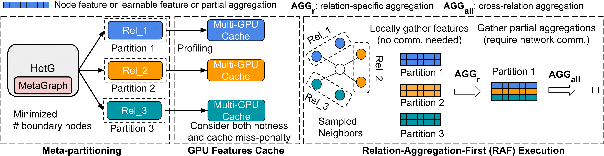

# Heta: Distributed Training of Heterogeneous Graph Neural Networks

This repository contains the code for the paper "Heta: Distributed Training of Heterogeneous Graph Neural Networks".

## Overview

Heta is a framework designed to address the communication bottleneck in distributed heterogeneous graph neural networks (HGNNs) training. Heta leverages the key insight that HGNN aggregation is order-invariant and decomposable into relation-specific computations. Built on this insight, we introduce three key innovations: 
- a Relation-Aggregation-First (RAF) paradigm that conducts relation-specific aggregations within partitions and exchanges only partial aggregations across machines, proven to reduce communication complexity; 
- a meta-partitioning strategy that divides a HetG based on its graph schema and HGNN computation dependency while minimizing cross-partition communication and maintaining computation and storage balance; 
- a heterogeneity-aware GPU cache system that accounts for varying miss-penalty ratios across node types.



## Requirements

- Python 3.7+
- CUDA 11.0+
- PyTorch 1.10+
- DGL 0.9+
- Additional dependencies:
    - numpy
    - networkx

## Installation

1. Clone the repository with submodules:

```bash
git clone https://github.com/jasperzhong/Heta.git
cd Heta
```

2. Initialize and update submodules:
```bash
git submodule init
git submodule update 
```

3. Install DGL from source: we have modified hundreds of lines of code in DGL to support Heta (see `third_party/dgl`). To install DGL from source, please refer to https://docs.dgl.ai/install/index.html#install-from-source.


4. Install other dependencies:
    
```bash
pip install -r requirements.txt
```

## Repo Structure

- `proof.pdf` contains the proof of the three propositions in the paper.

- `load_graph.py` contains the heterogeneous graph loader.
- `metatree.py` and `partition_graph.py` contain the implementation of the meta-partitioning algorithm.
- `presampling.py`, `miss_penalty.py` and `gpu_cache.py` contain the implementation of the GPU caching strategies.
- `model.py` contains the implementation of the HGNN models using the Relation-Aggregation-First (RAF) paradigm.
- `train_dist.py` contains the distributed training script.

## Datasets

The code supports various heterogeneous graph datasets including those from 
- ogbn-mag: https://ogb.stanford.edu/docs/nodeprop/#ogbn-mag
- Freebase: https://github.com/BUPT-GAMMA/OpenHGNN/blob/main/openhgnn/dataset/ohgb.md
- Donor: https://www.kaggle.com/competitions/donorschoose-application-screening/data
- IGB-HET: https://github.com/IllinoisGraphBenchmark/IGB-Datasets 
- MAG240M: https://ogb.stanford.edu/docs/lsc/mag240m/

## Running Experiments

To run Heta on a dataset (take ogbn-mag as an example), follow the steps below:

1. Prepare the distributed environment: prepare `ipconfig.txt` file with the ip addresses of the machines in the cluster

2. Partition the graph:
```bash
python partition_graph.py --dataset ogbn-mag --num_parts 2
```

Each machine will load a partition of the graph. The number of partitions should be equal to the number of machines in the cluster.

3. Profile miss-penalty for GPU cache (optional): 
```bash
python miss_penalty.py --dataset ogbn-mag 
```

Enable the GPU cache in `run.sh` by setting `CACHE_METHOD` to `miss_penalty`. Default is `none`.

4. Train the model:
```bash
./run.sh rgcn ogbn-mag 
```

## License

This project is licensed under the Apache License 2.0 - see the LICENSE file for details.
